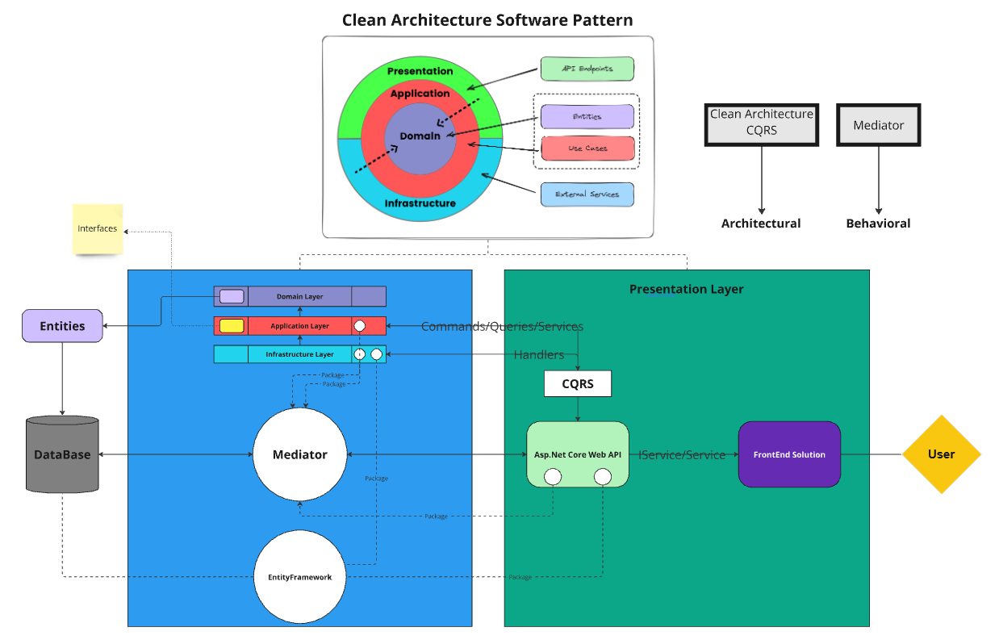
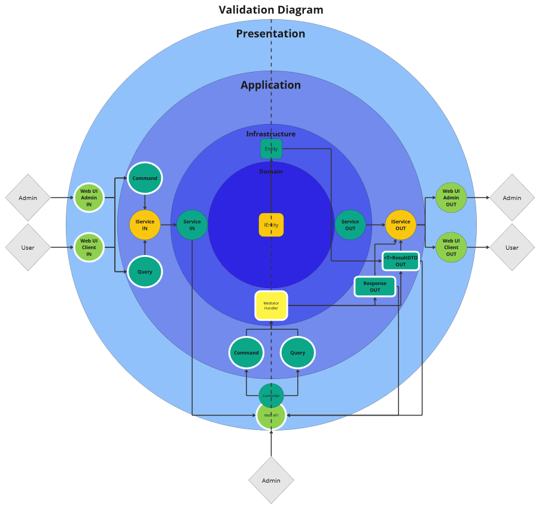
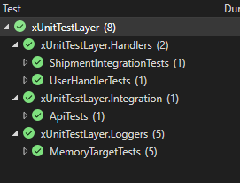

# Frenet Exam Project

## Table of Contents
0. [Introduction](#introduction)
1. [Prerequisites](#prerequisites)
2. [SQL Tables Setup](#sql-tables-setup)
3. [Environment Setup](#environment-setup)
4. [Running the Application](#running-the-application)
5. [Diagrams](#diagrams)
6. [Testing](#testing)
7. [Exam Answers](#exam-answers)
8. [License](#license)

## Introduction
- Welcome to the FRENET Exam project! This document provides a comprehensive guide to setting up and running the application. It includes instructions for setting up the database, configuring the environment, running the application, and more.

## Prerequisites
Before you begin, ensure you have the following software and tools installed:
- [.NET 8 SDK](https://dotnet.microsoft.com/pt-br/download/dotnet/8.0)
- [SQL Server](https://www.microsoft.com/en-us/sql-server/sql-server-downloads)
- [Visual Studio](https://visualstudio.microsoft.com/)
- [MelhorEnvioAPIToken](https://app.melhorenvio.com.br/integracoes/permissoes-de-acesso)

## SQL Tables Setup
### Step 1: Create Database
- Run the necessary SQL scripts to create the database and tables, inside the 'Misc' folder you'll find several SQL Scripts execute them in this order:

## FIRST DATABASE CLIENT DATA 
- A. Run 'SQLQuery_AspNetUserIdentity_Tables' to generate the AspNetUser Tables, we're going to use it to user Auth.
- B. Run 'SQLQuery_Clients_Address_Shipments_Table' to generate the Clients/Addresses/Shipments Tables, we're going to use it to store clients data.

## SECOND DATABASE LOGS DATA
- A. Run 'SQLQuery_NLog_Table' to generate the NLog main table, this table is mutable by the other tables, storing only the last data value.
- B. Run 'SQLQuery_NLog_Create_Table' & 'SQLQuery_NLog_Update_Table' & 'SQLQuery_NLog_Delete_Table' these tables only insert new logs and serves as audit trails.
- C. Run the respectives '_StoredProcedure' from each table, we're delegating the Db logic to itself to better work with NLog in code.

### Step 2: Seed Data
- Optionally, seed the database with initial data.

## Environment Setup
### Step 1: Configure Environment Variables (Remove Quotation Marks)

Set the following environment variables in your development environment for database/api connection:
- A. Name: 'ASPNETCORE_FRENETEXAM_DEV' Value: 'YourDBConnectionString' 
- B. Name: 'ASPNETCORE_FRENETEXAMLOGS_DEV' Value: 'YourLogsDBConnectionString'
- C. Name: 'ASPNETCORE_FRENETEXAM_EXTERNALTOKEN_DEV' Value: 'YourExternalApiToken' (This must be a valid MelhorEnvio API token)
- Obs: : Link in the index > Create your Account > Painel > Integrações > Permissão de Acesso > Gerar Novo Token - select 'shipping-calculate')

Set the following environment variables in your development environment for JWT Tokenization:
- A. Name: 'JwtFEAudience' Value: 'https://localhost:7121/' (Or override in launchsettings with a valid local port)
- B. Name: 'JwtFEIssuer' Value: 'https://localhost:7121/' (Or override in launchsettings with a valid local port)
- C. Name: 'JwtFEKey' Value: 'your-256-bit-secret' (ex: kXjXzP7sIFut4lFGhEW1ie238fnIxUxz)
- 
### (You need to restart Visual Studio to reload Enviromental Variables)
## Running the Application
- Set the 'WebAPI' inside 'PresentationLayer.csproj' as your startup project, if you need to scaffolding something set your default project in the Project Manager window as InfrastructureLayer.csproj.

## Diagrams

## Testing
- The tests are located under xUnitTestLayer.csproj there are 8 tests, both Unit and Integration respecting the provided architecure, make sure you have opened the Test Window where you can Run tests or Debug them.
  

## Exam Answers
### Seção 1: C# e Desenvolvimento de API Restful

1. **Qual é o objetivo principal de usar o ASP.NET MVC em uma aplicação web?**
   - A) Para criar aplicativos de console
   - **B) Para estruturar aplicações web usando o padrão Model-View-Controller**
   - C) Para desenvolvimento de jogos 3D
   - D) Para implementar sistemas de automação residencial

2. **O que significa RESTful em APIs?**
   - A) Um protocolo de rede
   - **B) Um estilo arquitetural para comunicação web**
   - C) Um tipo de banco de dados
   - D) Um framework de desenvolvimento para jogos

3. **Qual é a principal vantagem de usar o Entity Framework em projetos C#?**
   - A) Melhorar o desempenho de jogos
   - **B) Facilitar o mapeamento de objetos para bancos de dados relacionais**
   - C) Gerenciar a memória de forma mais eficiente
   - D) Criar interfaces gráficas de usuário

4. **Qual dos seguintes métodos HTTP é usado para atualizar um recurso em uma API RESTful?**
   - A) GET
   - B) POST
   - **C) PUT**
   - D) DELETE

5. **O que é um DTO (Data Transfer Object) em C#?**
   - A) Um tipo de dado para transferência de arquivos binários
   - **B) Um objeto usado para transferir dados entre camadas de uma aplicação**
   - C) Um sistema de automação de testes
   - D) Um serviço de armazenamento em nuvem

6. **Como é possível definir rotas em uma aplicação ASP.NET Core?**
   - A) Usando arquivos de configuração XML
   - **B) Usando anotações (attributes) nos controladores e métodos**
   - C) Apenas pelo arquivo `web.config`
   - D) Definindo diretamente no banco de dados

7. **O que é Dependency Injection (DI) em ASP.NET Core?**
   - A) Um método para injetar código malicioso em uma aplicação
   - **B) Uma técnica para gerenciar dependências de classes e serviços**
   - C) Um padrão de projeto usado para criar interfaces de usuário
   - D) Um sistema para criptografar dados

8. **Em uma API RESTful, qual status code indica que um recurso foi criado com sucesso?**
   - A) 200 OK
   - B) **201 Created**
   - C) 204 No Content
   - D) 400 Bad Request

9. **Qual é a diferença entre o método POST e o método PUT em APIs RESTful?**
   - A) POST é idempotente; PUT não é
   - B) **PUT é idempotente; POST não é**
   - C) POST é usado para deletar recursos; PUT é usado para criá-los
   - D) Não há diferença significativa entre os dois

10. **Qual dos seguintes é uma prática recomendada ao lidar com exceções em C#?**
    - A) Ignorar as exceções para melhorar o desempenho
    - B) Lançar exceções para indicar fluxos normais de controle
    - **C) Capturar exceções específicas e fornecer mensagens de erro úteis**
    - D) Evitar o uso de try-catch para simplificar o código

11. **O que é ASP.NET Core Middleware?**
    - A) Um serviço de hospedagem em nuvem
    - **B) Um componente que forma o pipeline de solicitação e resposta em ASP.NET Core**
    - C) Uma biblioteca de interface gráfica
    - D) Uma extensão para o Visual Studio

12. **Qual dos seguintes é um benefício do uso de controladores baseados em API em ASP.NET Core?**
    - A) Melhor suporte para operações assíncronas
    - **B) Melhoria na gestão de estado da aplicação**
    - C) Integração direta com o frontend da aplicação
    - D) Redução da necessidade de configurações de segurança

### Seção 2: Banco de Dados Microsoft SQL Server

1. **Qual comando SQL é utilizado para criar uma nova tabela em um banco de dados?**
   - A) INSERT INTO
   - **B) CREATE TABLE**
   - C) ALTER TABLE
   - D) DROP TABLE

2. **O que é uma Primary Key em um banco de dados relacional?**
   - A) Um campo que armazena valores duplicados
   - **B) Um campo que identifica unicamente cada registro em uma tabela**
   - C) Um índice que acelera consultas
   - D) Um tipo de restrição de integridade referencial

3. **Qual comando SQL é utilizado para alterar a estrutura de uma tabela existente?**
   - A) UPDATE
   - B) MODIFY
   - **C) ALTER TABLE**
   - D) RENAME TABLE

4. **O que é uma Foreign Key em SQL?**
   - A) Um campo que armazena valores estrangeiros
   - **B) Uma chave que refere-se a uma Primary Key de outra tabela**
   - C) Um índice de pesquisa rápida
   - D) Um comando para deletar registros

5. **Como você define uma transação em SQL Server?**
   - **A) Um conjunto de operações SQL que é executado de forma atômica**
   - B) Um processo de backup de banco de dados
   - C) Um tipo de consulta SQL para filtrar dados
   - D) Uma ferramenta de análise de desempenho de banco de dados

6. **O que é um índice em SQL Server e qual sua principal finalidade?**
   - A) Um campo especial usado para criptografar dados
   - **B) Um mecanismo para acelerar consultas e melhorar o desempenho**
   - C) Um tipo de chave que restringe a duplicação de dados
   - D) Um comando SQL para ordenar resultados

7. **Qual é o resultado da execução de um comando DELETE sem cláusula WHERE?**
   - A) Remove um único registro aleatório da tabela
   - **B) Remove todos os registros da tabela**
   - C) Remove a estrutura da tabela
   - D) Não afeta a tabela

8. **O que é um Join em SQL?**
   - A) Um comando para adicionar novos campos em uma tabela
   - **B) Uma operação para combinar registros de duas ou mais tabelas**
   - C) Uma função para calcular a soma de valores em uma coluna
   - D) Uma operação para criar tabelas temporárias

9. **Qual comando SQL é usado para retornar apenas valores distintos de uma coluna?**
   - **A) DISTINCT**
   - B) UNIQUE
   - C) FILTER
   - D) DISTINCT VALUES

10. **O que é um stored procedure em SQL Server?**
    - A) Uma tabela de valores pré-calculados
    - **B) Um conjunto de comandos SQL que pode ser executado como uma única unidade**
    - C) Uma chave primária composta
    - D) Uma técnica de indexação avançada

11. **Como você pode melhorar a performance de uma query em SQL Server?**
    - A) Usando subconsultas em vez de joins
    - B) Evitando o uso de índices
    - **C) Criando índices nas colunas usadas em filtros e junções**
    - D) Normalizando todas as tabelas ao máximo

12. **O que é uma View em SQL Server?**
    - A) Um snapshot estático de uma tabela
    - B) Uma tabela temporária usada apenas para armazenamento
    - **C) Uma consulta armazenada que pode ser tratada como uma tabela**
    - D) Um arquivo de log de transações

### Seção 3: Padrão Swagger

1. **O que é o Swagger em relação ao desenvolvimento de APIs?**
   - A) Um framework para autenticação
   - **B) Uma ferramenta de documentação e especificação de APIs**
   - C) Um protocolo de transferência de dados
   - D) Um sistema de controle de versão

2. **Qual é a principal vantagem de usar Swagger/OpenAPI na documentação de APIs?**
   - A) Facilita a automação de testes de interface gráfica
   - **B) Permite a geração automática de código para cliente e servidor**
   - C) Melhora a segurança da API
   - D) Aumenta a velocidade de resposta da API

3. **Como o Swagger UI ajuda os desenvolvedores?**
   - **A) Ao fornecer uma interface gráfica para testes interativos de APIs**
   - B) Ao otimizar a performance das requisições HTTP
   - C) Ao criar bancos de dados relacionais
   - D) Ao gerenciar sessões de usuário

4. **O que é um "path" no contexto de uma especificação Swagger?**
   - A) Um tipo de middleware para segurança de APIs
   - **B) Um endpoint de API que define as operações que podem ser realizadas**
   - C) Um campo obrigatório para autenticação de API
   - D) Um protocolo de comunicação

## License
- This project is personal and made as a technical exam and portfolio demonstration, as there is no license it falls under Default Licensing, retaining all rights to distribution or remixing, derivation or branching is not allowed, only showing and using by allowed profiles.
